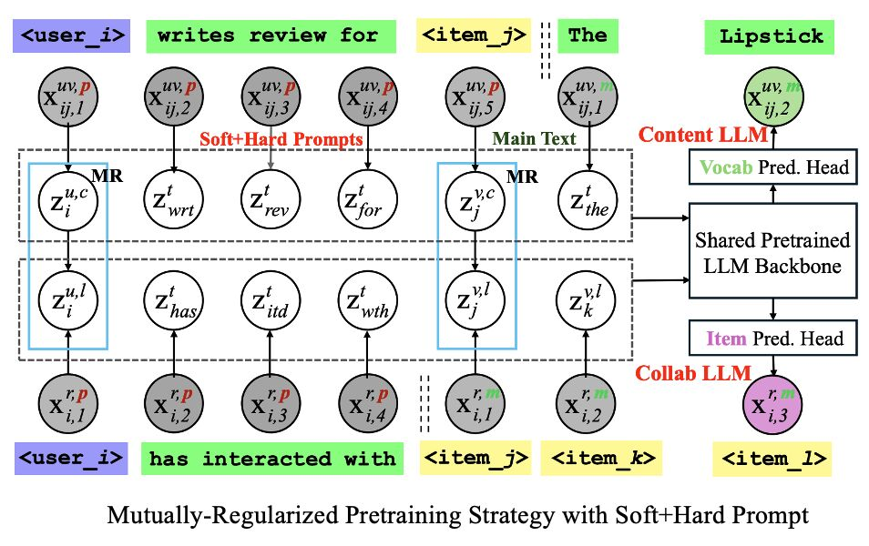

# CLLM4Rec: Collaborative Large Language Model for Recommender Systems

These codes are associated with the following [paper](https://arxiv.org/abs/2311.01343):
>Collaborative Large Language Model for Recommender Systems  
>**Yaochen Zhu**, Liang Wu, Qi Guo, Liangjie Hong, Jundong Li,   
>ArXiv 2023.
  
## 1. Introduction
The proposed CLLM4Rec is the **first** recommender system that tightly combines the ID-based paradigm and LLM-based paradigm and leverages the advantages of both worlds.   
<p align="center">

</p>

## 2. Structure of Codes

### 2.1. Horizontal Structure
We implement the following main classes based on the Hugging Face🤗 [transformer](https://github.com/huggingface/transformers) library.

#### 2.1.1. GPT4Rec Tokenizer Class:
**TokenizerWithUserItemIDTokens** breaks down the word sequence into tokens, where user/item tokens are introduced. Specifically, if the vocabulary size of the original tokenizer is $N$, for a system with $I$ users and $J$ items, user ID words, i.e., "user_i" and "item_j", are treated as atomic tokens, where the tokenized ID for token "user_i" is $N+i$, whereas the tokenized ID for token "item_j" is $N+I+j$. **Demo:**
```
-----Show the encoding process:-----
Hello, user_1! Have you seen item_2?
['Hello', ',', 'user_1', '!', 'ĠHave', 'Ġyou', 'Ġseen', 'item_2', '?']
[15496, 11, 50258, 0, 8192, 345, 1775, 50269, 30]
```
#### 2.1.2. GPT4Rec Base Model Class:
**GPT4RecommendationBaseModel** is the base class for collaborative GPT for recommender systems.  This class extends the vocabulary of the original GPT2 model with the user/item ID tokens. In our implementation, we randomly initialize the user/item ID embeddings. In the training time, we load the token embeddings for the original vocabulary and the transformer weights, and we freeze them so that only user/item ID embeddings can be updated. **Demo:**

```
input_ids:
tensor([[0, 1, 2],
        [3, 4, 5],
        [6, 7, 8]])

-----Calculated Masks-----
vocab_mask:
tensor([[1, 1, 1],
        [0, 0, 0],
        [0, 0, 0]])

user_mask:
tensor([[0, 0, 0],
        [1, 1, 1],
        [0, 0, 0]])

item_mask:
tensor([[0, 0, 0],
        [0, 0, 0],
        [1, 1, 1]])

-----Embed Vocabulary Tokens-----
vocab_ids:
tensor([[0, 1, 2],
        [0, 0, 0],
        [0, 0, 0]])

vocab_embeddings:
tensor([[[ 1.4444,  0.0186],
         [-0.3905,  1.5463],
         [-0.2093, -1.3653]],

        [[ 0.0000,  0.0000],
         [ 0.0000,  0.0000],
         [ 0.0000,  0.0000]],

        [[ 0.0000,  0.0000],
         [ 0.0000,  0.0000],
         [ 0.0000,  0.0000]]], grad_fn=<MulBackward0>)

-----Embed User Tokens-----
user_ids:
tensor([[0, 0, 0],
        [0, 1, 2],
        [0, 0, 0]])

user_embeds:
tensor([[[-0.0000,  0.0000],
         [-0.0000,  0.0000],
         [-0.0000,  0.0000]],

        [[-0.1392,  1.1265],
         [-0.7857,  1.4319],
         [ 0.4087, -0.0928]],

        [[-0.0000,  0.0000],
         [-0.0000,  0.0000],
         [-0.0000,  0.0000]]], grad_fn=<MulBackward0>)

-----Embed Item Tokens-----
item_ids:
tensor([[0, 0, 0],
        [0, 0, 0],
        [0, 1, 2]])

item_embeds:
tensor([[[-0.0000,  0.0000],
         [-0.0000,  0.0000],
         [-0.0000,  0.0000]],

        [[-0.0000,  0.0000],
         [-0.0000,  0.0000],
         [-0.0000,  0.0000]],

        [[-0.3141,  0.6641],
         [-1.4622, -0.5424],
         [ 0.6969, -0.6390]]], grad_fn=<MulBackward0>)

-----The Whole Embeddings-----
input_embeddings:
tensor([[[ 1.4444,  0.0186],
         [-0.3905,  1.5463],
         [-0.2093, -1.3653]],

        [[-0.1392,  1.1265],
         [-0.7857,  1.4319],
         [ 0.4087, -0.0928]],

        [[-0.3141,  0.6641],
         [-1.4622, -0.5424],
         [ 0.6969, -0.6390]]], grad_fn=<AddBackward0>)
```


#### 2.1.3. Collaborative GPT Class:

**CollaborativeGPTwithItemLMHeadBatch** defines the collaborative GPT, which gives prompts in the form "user_i has interacted with", to do language modeling (i.e., next token prediction) for the interacted item sequences, i.e., "item_j item_k item_z". In this case, when doing next token prediction, we only need to calculate softmax over the **item space**. **Demo:**

```
Prompt ids: tensor([[50257,   468, 49236,   351],
        [50258,   468, 49236,   351],
        [50259,   468, 49236,   351],
        [50260,   468, 49236,   351],
        [50261,   468, 49236,   351],
        [50262,   468, 49236,   351],
        [50263,   468, 49236,   351],
        [50264,   468, 49236,   351],
        [50265,   468, 49236,   351],
        [50266,   468, 49236,   351],
        [50267,   468, 49236,   351],
        [50268,   468, 49236,   351],
        [50269,   468, 49236,   351],
        [50270,   468, 49236,   351],
        [50271,   468, 49236,   351],
        [50272,   468, 49236,   351]])
Main ids: tensor([[51602, 51603, 51604, 51605, 51607, 51608, 51609, 51610, 51613, 51614,
         51615, 51616, 51617, 51618, 51619, 51621, 51622, 51624, 51625, 51626,
         51628, 51630, 51632, 51633, 51634, 51635, 51636, 51637,     0,     0,
             0,     0],
        [51638, 51640, 51641, 51642, 51643, 51645,     0,     0,     0,     0,
             0,     0,     0,     0,     0,     0,     0,     0,     0,     0,
             0,     0,     0,     0,     0,     0,     0,     0,     0,     0,
             0,     0],
        [51647, 51648, 51649, 51650, 51652, 51653, 51654, 51655,     0,     0,
             0,     0,     0,     0,     0,     0,     0,     0,     0,     0,
             0,     0,     0,     0,     0,     0,     0,     0,     0,     0,
             0,     0],
        [51605, 51623, 51656, 51657, 51659, 51660, 51662, 51663,     0,     0,
             0,     0,     0,     0,     0,     0,     0,     0,     0,     0,
             0,     0,     0,     0,     0,     0,     0,     0,     0,     0,
             0,     0],
        [51664, 51665, 51666, 51667, 51668, 51670, 51672,     0,     0,     0,
             0,     0,     0,     0,     0,     0,     0,     0,     0,     0,
             0,     0,     0,     0,     0,     0,     0,     0,     0,     0,
             0,     0],
        [51673, 51674, 51676, 51677, 51678, 51679, 51680, 51681, 51682, 51683,
         51684, 51685, 51686, 51687, 51691, 51695, 51696, 51698, 51699, 51700,
         51701, 51702, 51703, 51704, 51705, 51706, 51707, 51708, 51709, 51710,
         51711, 51712],
        [51713, 51714, 51716, 51717, 51718, 51719, 51720, 51721, 51722, 51723,
         51724,     0,     0,     0,     0,     0,     0,     0,     0,     0,
             0,     0,     0,     0,     0,     0,     0,     0,     0,     0,
             0,     0],
        [51604, 51611, 51612, 51616, 51666, 51727, 51728, 51729, 51731, 51732,
         51733, 51734, 51735, 51737, 51738, 51740,     0,     0,     0,     0,
             0,     0,     0,     0,     0,     0,     0,     0,     0,     0,
             0,     0],
        [51741, 51742, 51743, 51744, 51747, 51748, 51749,     0,     0,     0,
             0,     0,     0,     0,     0,     0,     0,     0,     0,     0,
             0,     0,     0,     0,     0,     0,     0,     0,     0,     0,
             0,     0],
        [51619, 51625, 51732, 51750, 51751, 51752, 51753, 51754,     0,     0,
             0,     0,     0,     0,     0,     0,     0,     0,     0,     0,
             0,     0,     0,     0,     0,     0,     0,     0,     0,     0,
             0,     0],
        [51621, 51640, 51645, 51672, 51741, 51756, 51758, 51759, 51760, 51761,
         51763, 51765,     0,     0,     0,     0,     0,     0,     0,     0,
             0,     0,     0,     0,     0,     0,     0,     0,     0,     0,
             0,     0],
        [51618, 51763, 51767, 51768, 51769, 51770,     0,     0,     0,     0,
             0,     0,     0,     0,     0,     0,     0,     0,     0,     0,
             0,     0,     0,     0,     0,     0,     0,     0,     0,     0,
             0,     0],
        [51625, 51769, 51771, 51772, 51773, 51775, 51776, 51777, 51778, 51780,
             0,     0,     0,     0,     0,     0,     0,     0,     0,     0,
             0,     0,     0,     0,     0,     0,     0,     0,     0,     0,
             0,     0],
        [51673, 51674, 51675, 51676, 51677, 51679, 51681, 51694, 51699, 51701,
         51781, 51782, 51783, 51785, 51786,     0,     0,     0,     0,     0,
             0,     0,     0,     0,     0,     0,     0,     0,     0,     0,
             0,     0],
        [51660, 51737, 51758, 51787, 51788, 51789, 51790, 51792, 51793, 51794,
         51795, 51796, 51798, 51799, 51800, 51801,     0,     0,     0,     0,
             0,     0,     0,     0,     0,     0,     0,     0,     0,     0,
             0,     0],
        [51661, 51760, 51793, 51804, 51805, 51806,     0,     0,     0,     0,
             0,     0,     0,     0,     0,     0,     0,     0,     0,     0,
             0,     0,     0,     0,     0,     0,     0,     0,     0,     0,
             0,     0]])
Calculated loss: 14.4347
```
#### 2.1.4. Content GPT Class:

**ContentGPTForUserItemWithLMHeadBatch** defines the content GPT that conducts language modeling on user/item content. Take  Amazon review data as an example, it treats "user_i writes the following review for item_j" as the prompt, while conducting language modeling (i.e., next token prediction) on the main review texts. In this case, when predicting next tokens, we only need to calculate the softmax over the **vocabulary space. Demo**:

```
Prompt ids: tensor([[50257,  2630,   262,  1708,  2423,   329, 51602,    25],
        [50257,  2630,   262,  1708,  2423,   329, 51603,    25],
        [50257,  2630,   262,  1708,  2423,   329, 51604,    25],
        [50257,  2630,   262,  1708,  2423,   329, 51605,    25],
        [50257,  2630,   262,  1708,  2423,   329, 51607,    25],
        [50257,  2630,   262,  1708,  2423,   329, 51608,    25],
        [50257,  2630,   262,  1708,  2423,   329, 51609,    25],
        [50257,  2630,   262,  1708,  2423,   329, 51610,    25],
        [50257,  2630,   262,  1708,  2423,   329, 51613,    25],
        [50257,  2630,   262,  1708,  2423,   329, 51614,    25],
        [50257,  2630,   262,  1708,  2423,   329, 51615,    25],
        [50257,  2630,   262,  1708,  2423,   329, 51616,    25],
        [50257,  2630,   262,  1708,  2423,   329, 51617,    25],
        [50257,  2630,   262,  1708,  2423,   329, 51618,    25],
        [50257,  2630,   262,  1708,  2423,   329, 51619,    25],
        [50257,  2630,   262,  1708,  2423,   329, 51621,    25]])
Main ids: tensor([[   40,   716,   281,  ...,     0,     0,     0],
        [ 1544,  1381,   510,  ...,   428,  5156,     0],
        [ 3666,  4957, 10408,  ...,     0,     0,     0],
        ...,
        [   35,   563,   911,  ...,     0,     0,     0],
        [23044,  1049,   351,  ...,     0,     0,     0],
        [26392,  2499,   880,  ...,     0,     0,     0]])
Calculated loss: 3.9180
```
#### 2.1.5. Rec GPT Class:

**CollaborativeGPTwithItemRecommendHead** defines the recommendation GPT, where we randomly mask out items in the interaction history of the users and predict the hold-out items with multinomial likelihood. **Demo:**
```
num_users: 10553
num_items: 6086
Prompt ids: tensor([[50257,   468, 49236,   351, 60819, 60812, 60818, 60811, 60816, 60810,
         60822, 60823, 60820, 60817,    11, 50257,   481,  9427,   351,     0,
             0,     0,     0,     0,     0,     0,     0,     0,     0,     0,
             0,     0,     0,     0,     0,     0,     0,     0],
        [50258,   468, 49236,   351, 60828, 60824, 60829, 60825,    11, 50258,
           481,  9427,   351,     0,     0,     0,     0,     0,     0,     0,
             0,     0,     0,     0,     0,     0,     0,     0,     0,     0,
             0,     0,     0,     0,     0,     0,     0,     0],
        [50259,   468, 49236,   351, 60833, 60835,    11, 50259,   481,  9427,
           351,     0,     0,     0,     0,     0,     0,     0,     0,     0,
             0,     0,     0,     0,     0,     0,     0,     0,     0,     0,
             0,     0,     0,     0,     0,     0,     0,     0],
        [50260,   468, 49236,   351, 60840, 60838,    11, 50260,   481,  9427,
           351,     0,     0,     0,     0,     0,     0,     0,     0,     0,
             0,     0,     0,     0,     0,     0,     0,     0,     0,     0,
             0,     0,     0,     0,     0,     0,     0,     0],
        [50261,   468, 49236,   351, 60845, 60842, 60847, 60841,    11, 50261,
           481,  9427,   351,     0,     0,     0,     0,     0,     0,     0,
             0,     0,     0,     0,     0,     0,     0,     0,     0,     0,
             0,     0,     0,     0,     0,     0,     0,     0],
        [50262,   468, 49236,   351, 60852, 60853, 60848,    11, 50262,   481,
          9427,   351,     0,     0,     0,     0,     0,     0,     0,     0,
             0,     0,     0,     0,     0,     0,     0,     0,     0,     0,
             0,     0,     0,     0,     0,     0,     0,     0],
        [50263,   468, 49236,   351, 60855, 60854,    11, 50263,   481,  9427,
           351,     0,     0,     0,     0,     0,     0,     0,     0,     0,
             0,     0,     0,     0,     0,     0,     0,     0,     0,     0,
             0,     0,     0,     0,     0,     0,     0,     0],
        [50264,   468, 49236,   351, 60893, 60899, 60894, 60869, 60859, 60875,
         60862, 60888, 60877, 60891, 60876, 60890, 60873, 60889, 60874, 60864,
         60860, 60878, 60898, 60867, 60900, 60883, 60892, 60882, 60884, 60881,
         60863, 60871, 60902,    11, 50264,   481,  9427,   351],
        [50265,   468, 49236,   351, 60907, 60905,    11, 50265,   481,  9427,
           351,     0,     0,     0,     0,     0,     0,     0,     0,     0,
             0,     0,     0,     0,     0,     0,     0,     0,     0,     0,
             0,     0,     0,     0,     0,     0,     0,     0],
        [50266,   468, 49236,   351, 60909, 60914, 60915, 60917, 60907, 60910,
         60908, 60912,    11, 50266,   481,  9427,   351,     0,     0,     0,
             0,     0,     0,     0,     0,     0,     0,     0,     0,     0,
             0,     0,     0,     0,     0,     0,     0,     0],
        [50267,   468, 49236,   351, 60922, 60920,    11, 50267,   481,  9427,
           351,     0,     0,     0,     0,     0,     0,     0,     0,     0,
             0,     0,     0,     0,     0,     0,     0,     0,     0,     0,
             0,     0,     0,     0,     0,     0,     0,     0],
        [50268,   468, 49236,   351, 60924, 60927,    11, 50268,   481,  9427,
           351,     0,     0,     0,     0,     0,     0,     0,     0,     0,
             0,     0,     0,     0,     0,     0,     0,     0,     0,     0,
             0,     0,     0,     0,     0,     0,     0,     0],
        [50269,   468, 49236,   351, 60929, 60930,    11, 50269,   481,  9427,
           351,     0,     0,     0,     0,     0,     0,     0,     0,     0,
             0,     0,     0,     0,     0,     0,     0,     0,     0,     0,
             0,     0,     0,     0,     0,     0,     0,     0],
        [50270,   468, 49236,   351, 60933, 60934,    11, 50270,   481,  9427,
           351,     0,     0,     0,     0,     0,     0,     0,     0,     0,
             0,     0,     0,     0,     0,     0,     0,     0,     0,     0,
             0,     0,     0,     0,     0,     0,     0,     0],
        [50271,   468, 49236,   351, 60940, 60943, 60939,    11, 50271,   481,
          9427,   351,     0,     0,     0,     0,     0,     0,     0,     0,
             0,     0,     0,     0,     0,     0,     0,     0,     0,     0,
             0,     0,     0,     0,     0,     0,     0,     0],
        [50272,   468, 49236,   351, 60949, 60945, 60944,    11, 50272,   481,
          9427,   351,     0,     0,     0,     0,     0,     0,     0,     0,
             0,     0,     0,     0,     0,     0,     0,     0,     0,     0,
             0,     0,     0,     0,     0,     0,     0,     0]])
Main ids: tensor([[1., 1., 1.,  ..., 0., 0., 0.],
        [0., 0., 0.,  ..., 0., 0., 0.],
        [0., 0., 0.,  ..., 0., 0., 0.],
        ...,
        [0., 0., 0.,  ..., 0., 0., 0.],
        [0., 0., 0.,  ..., 0., 0., 0.],
        [0., 0., 0.,  ..., 0., 0., 0.]])
Calculated loss: 124.3801
```


### 2.2. Vertical Structure

The codes are composed of three files that defines the pretraining, fine-tuning, and prediction stage of the proposed CLLM4Rec model.
```src/pretraining.py```:    

Define the pretraining stage of CLLM4Rec. 

```src/finetuning.py```:    
Dedine the finetuning stage of CLLM4Rec.

```src/predict.py```:     
Evaluate the trained model and save the results.

## 3. Environment

The codes are written in Python 3.9
- fsspec
- numpy==1.23.0
- scipy==1.8.0
- torch==2.0.0
- transformers==4.24.0
- wget==3.2
- accelerate

Details see src/requirements.txt

## 4. How to Run the Codes
source/run.sh    

## 🌟 Citation
If you find this work is helpful to your research, please consider citing our paper:
```
@article{zhu2023collaborative,
  title={Collaborative Large Language Model for Recommender Systems},
  author={Yaochen Zhu and Liang Wu and Qi Guo and Liangjie Hong and Jundong Li},
  journal={arXiv preprint arXiv:2311.01343},
  year={2023}
}
```
**Thanks for your interest in our work!**
